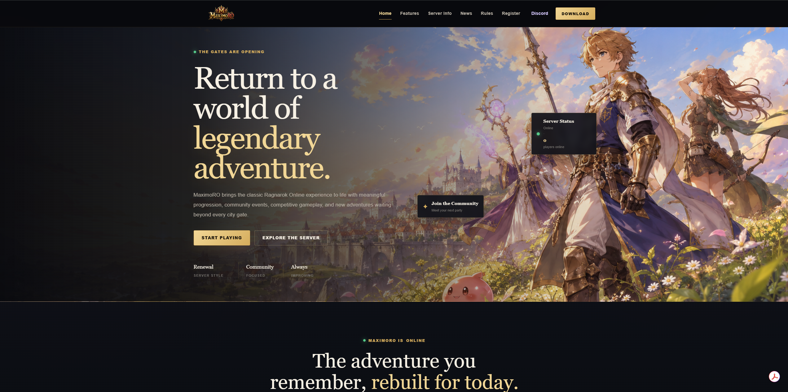
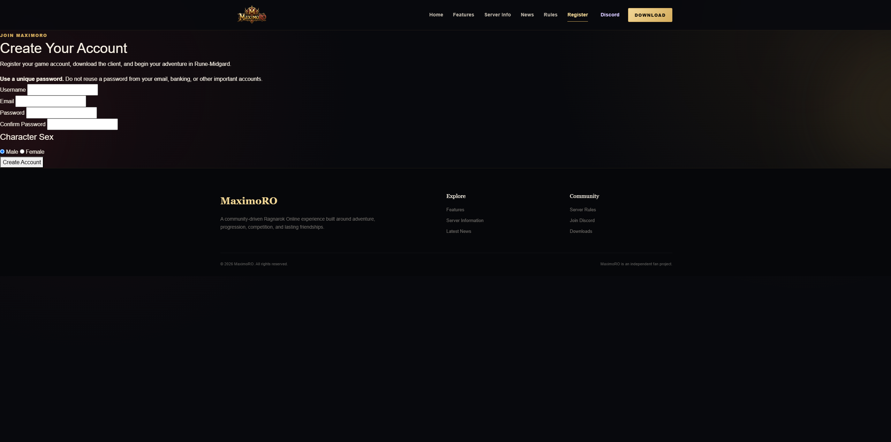
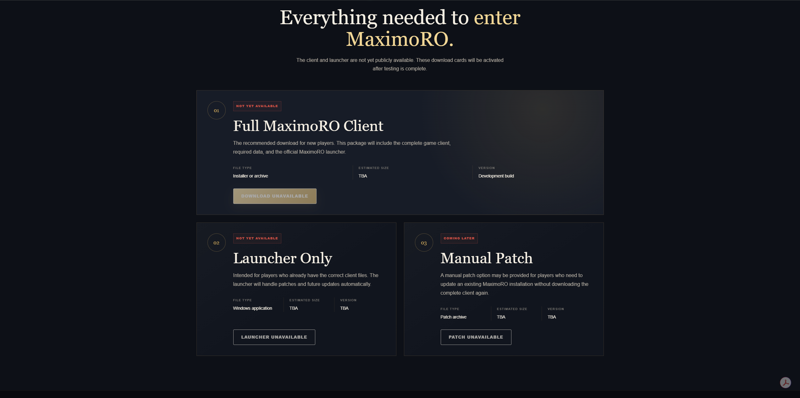
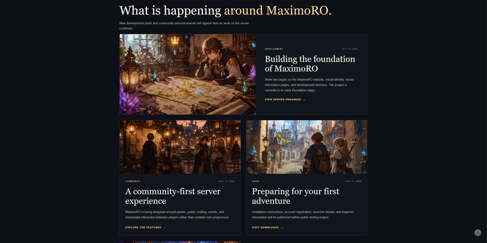

# MaximoROWeb

MaximoROWeb is an ASP.NET Core MVC website built for **MaximoRO**, a locally hosted Ragnarok Online server powered by rAthena and MariaDB.

The project provides a public-facing home for the server, including account registration, server information, downloads, rules, news, Discord links, and live server-status presentation. It also includes PowerShell tooling for development, production deployment, automatic startup, and self-healing recovery on Windows.

> MaximoROWeb is an independent fan project. Ragnarok Online is owned by Gravity Co., Ltd. rAthena is an open-source server emulator and is not included in this repository.

---

## Screenshots

### Homepage

<!-- Replace this placeholder with your screenshot -->


### Account Registration

<!-- Replace this placeholder with your screenshot -->


### Server Information

<!-- Replace this placeholder with your screenshot -->


### Downloads

<!-- Replace this placeholder with your screenshot -->


### News or Updates

<!-- Replace this placeholder with your screenshot -->


---

## Features

- Dark-fantasy Ragnarok Online visual theme
- Responsive ASP.NET Core MVC layout
- Public homepage and navigation
- MaximoRO server information
- MariaDB-backed account registration
- Registration validation and password confirmation
- Server-status presentation
- News and update pages
- Downloads page
- Server rules page
- Discord community page
- Development mode with `dotnet watch`
- Release publishing through PowerShell
- Automatic startup through Windows Task Scheduler
- Self-healing production process that restarts after crashes
- Production health verification through HTTP status checks
- Separate development and deployment workflows
- Local configuration files excluded from source control

---

## Technology Stack

- **ASP.NET Core MVC**
- **C#**
- **.NET 9**
- **Razor Views**
- **HTML**
- **CSS**
- **JavaScript**
- **MariaDB**
- **MySqlConnector**
- **PowerShell**
- **Windows Task Scheduler**
- **rAthena**

---

## Project Structure

```text
MaximoROWeb/
├── Controllers/
├── Models/
├── Services/
├── Views/
├── wwwroot/
│   ├── css/
│   ├── images/
│   ├── js/
│   └── lib/
├── scripts/
│   ├── dev.ps1
│   ├── deploy.ps1
│   └── start-maximoroweb.ps1
├── Properties/
├── appsettings.json
├── MaximoROWeb.csproj
├── Program.cs
└── README.md
```

The following local or generated files are intentionally excluded from Git:

```text
appsettings.Development.json
appsettings.Production.json
bin/
obj/
publish/
logs/
```

---

## Local Development

### Requirements

- Windows 10 or Windows 11
- .NET SDK compatible with the project
- MariaDB
- A configured rAthena database
- PowerShell
- Git

### Configuration

Create an `appsettings.Development.json` file locally:

```json
{
  "ConnectionStrings": {
    "RathenaDatabase": "Server=127.0.0.1;Port=3306;Database=ragnarok;User ID=YOUR_USER;Password=YOUR_PASSWORD;"
  }
}
```

Do not commit this file. It is ignored by `.gitignore`.

### Start Development Mode

From the project root:

```powershell
.\scripts\dev.ps1
```

Development mode runs the site with `dotnet watch`, allowing hot reload while editing.

You can also run it directly:

```powershell
dotnet watch run
```

The development site uses the URL defined in `Properties/launchSettings.json`.

---

## Production Deployment

The production website runs from the published Release build.

To publish the latest source code and restart the production website:

```powershell
.\scripts\deploy.ps1
```

The deployment script:

1. Stops the production Scheduled Task.
2. Builds the project in Release mode.
3. Publishes the application into `publish/`.
4. Re-enables and starts the production Scheduled Task.
5. Verifies that the website responds successfully.

Because the Scheduled Task runs with elevated permissions, the deployment script may request administrator approval.

---

## Self-Healing Hosting

MaximoROWeb is designed to remain online without requiring an open terminal or active desktop session.

The production hosting flow is:

```text
Windows startup
    ↓
MaximoROWeb Scheduled Task
    ↓
start-maximoroweb.ps1
    ↓
Published ASP.NET Core application
    ↓
Automatic restart after an unexpected exit
```

The PowerShell supervisor keeps the website process attached and automatically relaunches it after a crash.

The production website listens locally on:

```text
http://127.0.0.1:5041
```

External HTTPS access can be provided separately through a reverse proxy or secure tunneling service.

---

## rAthena Integration

MaximoROWeb connects to the rAthena MariaDB database to support website account registration.

The connection string is read using:

```csharp
configuration.GetConnectionString("RathenaDatabase")
```

Database credentials are stored only in local configuration and are not included in this repository.

The rAthena server software, game client, proprietary assets, and database contents are not included.

---

## Security Notes

- Database credentials are excluded from Git.
- Development and production configuration files are ignored.
- Build output and runtime logs are ignored.
- Registration input is validated through ASP.NET Core model validation.
- The database connection is managed through application configuration.
- Production hosting is bound to the local loopback interface.
- External exposure should be handled through a trusted reverse proxy or secure tunnel.
- No Ragnarok Online client files or proprietary game assets are distributed in this repository.

---

## Planned Improvements

- Automated live status checks for login, character, and map services
- Administrative news-post management
- Expanded download and patcher workflow
- Additional account-management tools
- Improved registration abuse protection
- Email verification
- Password recovery
- Deployment version display
- Automated testing
- Additional responsive design improvements

---

## Related Projects

### Palworld Server Manager

An ASP.NET Core moderator dashboard used to manage a locally hosted Palworld dedicated server.

Repository:

```text
https://github.com/maximowinfield/palworld-server-manager
```

### MaximoRO rAthena Environment

MaximoRO also uses a customized rAthena deployment with:

- MariaDB integration
- Windows startup scripts
- Login, character, and map-server monitoring
- Automatic crash recovery
- Client compatibility configuration
- Independent watchdog logging

The rAthena codebase is maintained separately and is not presented as original work.

---

## What I Built

My work on MaximoROWeb includes:

- ASP.NET Core MVC application architecture
- Razor page and layout design
- Dark-fantasy visual styling
- MariaDB-backed account registration
- Server-specific content and navigation
- PowerShell development and deployment scripts
- Published production hosting
- Windows Scheduled Task integration
- Automatic process recovery
- Local secret-management practices
- Integration with a self-hosted rAthena environment

This project demonstrates full-stack development, database integration, deployment automation, Windows server administration, and reliability engineering.

---

## Disclaimer

This repository contains original website code and automation created for MaximoRO.

Ragnarok Online and all related trademarks, artwork, and game assets belong to their respective owners. This project is not affiliated with or endorsed by Gravity Co., Ltd.

rAthena is an independent open-source server emulator. Any rAthena-related work should preserve its original attribution and license terms.

---

## Author

**Maximo Winfield**

- GitHub: `maximowinfield`
- Focus: C#, ASP.NET Core, React, JavaScript, Python, backend development, full-stack development, and server automation
